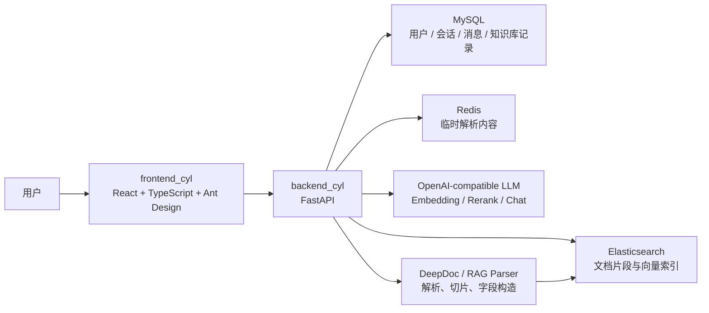

# 智能论文助手

> 面向论文阅读、资料检索与知识库问答的 AI 文档助手。系统支持论文上传解析、知识库检索、临时文档快问快答、流式对话、历史会话管理与引用来源展示，帮助用户把“读论文、找依据、问细节”变成一个连续的工作流。

<p align="center">
  
  
  
  
  
  
</p>

## 项目亮点

- **论文级文档解析**：支持 PDF、DOCX、TXT 等文档解析，并将内容切分为可检索片段。
- **RAG 知识库问答**：文档上传后写入 Elasticsearch，问答时结合文本检索与向量召回返回更贴近资料的答案。
- **当前会话快速解析**：无需正式入库，也可以上传当前会话临时文档，解析结果写入 Redis，适合快速提问。
- **SSE 流式输出**：回答边生成边展示，支持思考内容、正文、引用文档和推荐追问。
- **账号与历史会话**：提供注册、登录、JWT 鉴权、历史会话与历史消息恢复。
- **工程化部署**：后端通过 Docker Compose 编排 FastAPI、MySQL、Redis、Elasticsearch 与 Kibana。

## 效果概览

```text
用户登录
  -> 创建会话
  -> 上传论文 / 临时解析文档
  -> 文档解析、切片、向量化、入库
  -> 提问
  -> Elasticsearch 召回相关片段
  -> 大模型流式生成答案
  -> 展示回答、引用来源、推荐追问
  -> 保存历史会话与消息
```

## 技术架构



## 核心功能

| 模块 | 功能 | 说明 |
| --- | --- | --- |
| 用户系统 | 注册、登录、鉴权 | 使用 Bearer JWT 保护后端接口 |
| 会话系统 | 新建会话、历史会话、历史消息 | 重新登录或切换会话后可恢复聊天记录 |
| 知识库上传 | 长期文档上传、解析、入库 | 文档内容切片后写入 Elasticsearch |
| 快速解析 | 当前会话临时文档问答 | 解析内容写入 Redis，适合短期上下文 |
| 智能问答 | RAG 检索增强生成 | 结合知识库召回内容与当前会话文档生成回答 |
| 流式交互 | SSE 实时返回 | 前端逐段渲染回答、思考内容、引用与推荐问题 |
| 检索链路 | 文本检索 + 向量召回 | 支持 dense vector 字段、query 表达式与 rerank |
| 运维支撑 | Docker Compose | 一键启动 API、MySQL、Redis、ES、Kibana |

## 目录结构

```text
swxy/
  README.md                 # 项目展示与运行说明
  AGENTS.md                 # 项目维护指南
  DEVELOP.md                # 开发记录
  documents/                # 示例文档
  backend_cyl/              # FastAPI 后端
    main.py                 # 应用入口
    docker-compose.yaml     # 后端服务与基础设施编排
    Dockerfile              # 后端镜像构建
    requirements.txt        # Python 依赖
    app/
      core/                 # 配置、数据库、ES、日志
      db_models/            # ORM 数据模型
      router/               # 用户、聊天、历史相关接口
      features/             # 认证、会话、解析、检索等业务模块
      rag/                  # RAG 解析、检索、embedding、mapping
      deepdoc/              # 文档解析相关能力
  frontend_cyl/             # React 前端
    src/
      main.tsx              # 前端主应用
      styles.css            # 页面样式
      features/             # 前端业务辅助模块
```

## 快速启动

### 1. 启动后端服务

```powershell
cd backend_cyl
docker compose up -d --build
```

后端 API 默认运行在：

```text
http://localhost:8001
```

Kibana 默认运行在：

```text
http://localhost:5601
```

### 2. 启动前端服务

```powershell
cd frontend_cyl
npm install
npm run dev
```

启动成功后访问：

```text
http://localhost:5173/
```

## 环境配置

环境变量统一存放在：

```text
backend_cyl/.env
```

常用配置项包括：

| 变量 | 用途 |
| --- | --- |
| `MYSQL_HOST` / `MYSQL_PORT` | MySQL 连接地址 |
| `MYSQL_DATABASE_NAME` | 后端业务数据库名 |
| `MYSQL_USER` / `MYSQL_PASSWORD` | MySQL 账号配置 |
| `REDIS_HOST` / `REDIS_PORT` / `REDIS_DB` | Redis 临时解析缓存 |
| `ES_HOST` / `ES_HOSTS` | Elasticsearch 地址 |
| `ES_PASSWORD` | Elasticsearch 密码 |
| `JWT_SECRET_KEY` | JWT 签名密钥 |
| `DASHSCOPE_API_KEY` | 大模型、embedding、rerank 调用密钥 |
| `TIMEZONE` | 容器时区 |

> 注意：请不要将真实密钥、密码或 Token 提交到 GitHub。公开仓库建议只保留 `.env.example`。

## 主要接口

| 方法 | 路径 | 说明 |
| --- | --- | --- |
| `POST` | `/register` | 用户注册 |
| `POST` | `/login` | 用户登录 |
| `GET` | `/me` | 查询当前用户 |
| `POST` | `/create_session` | 创建聊天会话 |
| `GET` | `/get_sessions` | 获取历史会话 |
| `GET` | `/get_messages` | 获取指定会话历史消息 |
| `POST` | `/quick_parse` | 当前会话文档快速解析 |
| `GET` | `/get_parsed_content` | 获取快速解析内容 |
| `POST` | `/upload_files` | 上传文档并写入知识库 |
| `POST` | `/chat_on_docs` | 基于文档的流式问答 |

## RAG 工作流

1. 用户上传论文或资料文件。
2. 后端保存文件并调用解析模块提取文本内容。
3. 文档内容被切分为 chunk，并构造检索字段。
4. 系统调用 embedding 模型生成向量。
5. 文档片段与向量写入 Elasticsearch。
6. 用户提问时，系统从当前用户知识库中召回相关片段。
7. 召回内容与当前会话临时文档一起进入提示词。
8. 大模型通过 SSE 持续返回回答。
9. 后端保存问答记录，前端展示引用来源与推荐追问。

## 前端体验

- 登录 / 注册表单
- 工作台式聊天界面
- 历史会话切换
- 历史消息自动恢复
- 文档上传与解析状态反馈
- SSE 流式回答展示
- 引用文档与推荐追问展示
- 响应式页面布局

## 后端能力

- FastAPI 路由拆分
- JWT 用户认证
- SQLAlchemy ORM
- MySQL 数据持久化
- Redis 临时文档缓存
- Elasticsearch 文档索引与检索
- 文档解析、切片、embedding 入库
- OpenAI-compatible 模型调用
- SSE 流式响应
- Docker Compose 服务编排

## 开发命令

前端：

```powershell
cd frontend_cyl
npm run dev
npm run build
npm run preview
```

后端：

```powershell
cd backend_cyl
docker compose up -d --build
docker compose ps
docker compose logs app
```

## 项目定位

智能论文助手适合作为以下场景的项目基础：

- AI 论文阅读助手
- RAG 知识库问答系统
- 企业内部资料助手
- 文档解析与检索增强生成 Demo
- FastAPI + React + Elasticsearch 全栈项目展示

## 维护说明

- 删除文件时请只删除一个明确路径的文件，禁止批量递归删除。
- 不要把真实 `.env` 密钥写入 README、提交信息或公开文档。
- 修改 RAG 入库逻辑后，建议至少用一个小文件验证上传、检索、问答和历史记录。
- 修改 SSE 协议时，需要同步确认前端流式解析逻辑。
- 如果中文在终端中显示乱码，请优先用 UTF-8 编辑器或 `git diff` 复核，不要直接判断文件损坏。

## License

本项目当前未声明开源协议。如需公开发布，请先补充合适的 License。
